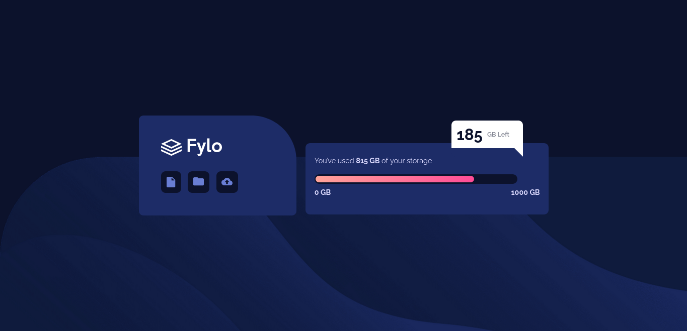

# Frontend Mentor - Fylo data storage component solution

This is a solution to the [Fylo data storage component challenge on Frontend Mentor](https://www.frontendmentor.io/challenges/fylo-data-storage-component-1dZPRbV5n). Frontend Mentor challenges help you improve your coding skills by building realistic projects. 

## Table of contents

- [Frontend Mentor - Fylo data storage component solution](#frontend-mentor---fylo-data-storage-component-solution)
  - [Table of contents](#table-of-contents)
  - [The challenge](#the-challenge)
  - [Screenshot](#screenshot)
  - [Links](#links)
  - [Built with](#built-with)
  - [Author](#author)

## The challenge

Users should be able to:

- View the optimal layout for the site depending on their device's screen size

## Screenshot

## Links

- Solution URL: [Source Code](https://github.com/benHaseep/fylo-data-storage-component)
- Live Site URL: [Live Preview](https://benHaseep.github.io/fylo-data-storage-component)

## Built with

- Semantic HTML5 markup
- CSS custom properties
- Flexbox
- Mobile-first workflow

## Author

- Website - [benHaseep](https://benHaseep.github.io)
- Frontend Mentor - [@benHaseep](https://www.frontendmentor.io/profile/benHaseep)
- Twitter - [@benHaseep](https://www.twitter.com/benHaseep)
